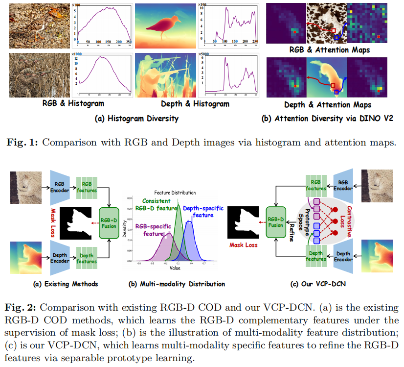
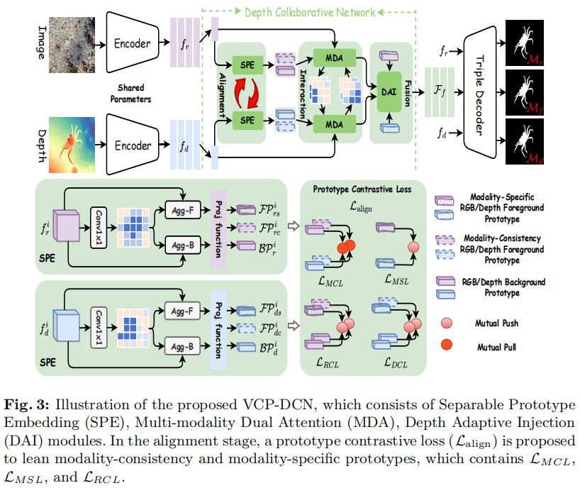
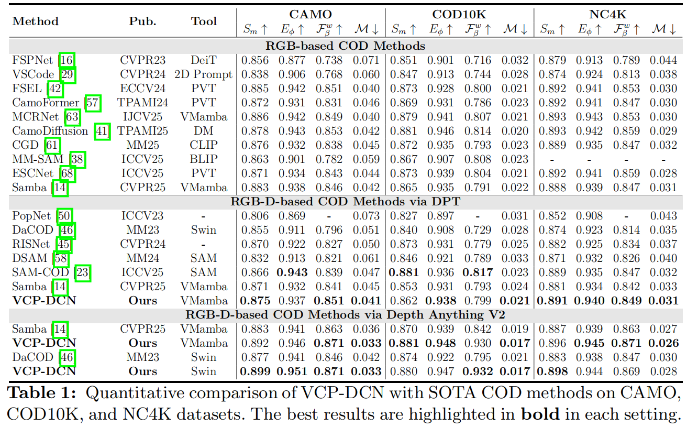
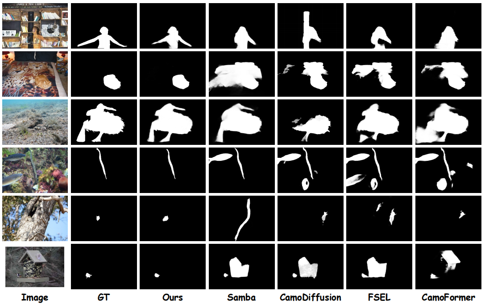
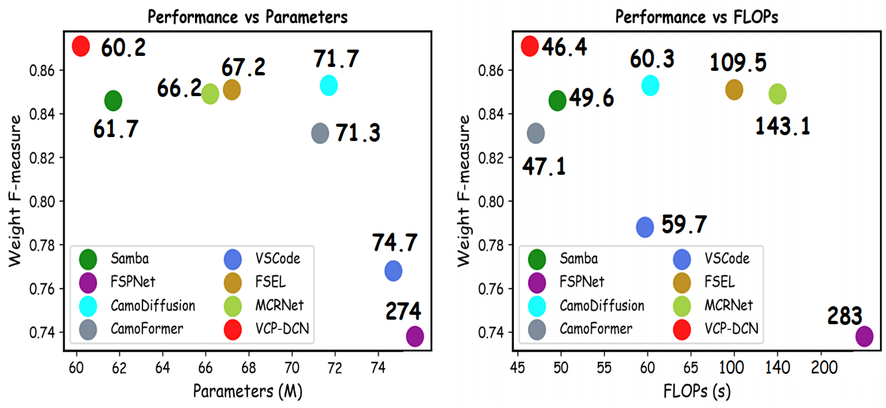

# VCP-DCN: Beyond Visual Concealed Property via Depth Collaborative Network for Camouflaged Object Detection (ECCV 2026)


Official PyTorch Implementation of VCP-DCN: Beyond Visual Concealed Property via Depth Collaborative Network for Camouflaged Object Detection

<a href='https://arxiv.org/pdf/2607.27843'></a> 


## Abstract
> Camouflaged Object Detection (COD) aims to identify and segment camouflaged objects in complex environments, which are often concealed because their color and texture are similar to the background. Several existing COD methods introduce depth maps to boost detection performance via learning complementary RGB-D features, ignoring modality-specific characteristics of concealed objects in the depth domain. To address this issue, we propose a depth collaborative network, called VCP-DCN, to mine distinguishable multi-modality features beyond visual concealed prototype in depth domain. Specifically, VCP-DCN progressively performs multi-modality alignment, interaction, and fusion for the COD task. In the alignment stage, we propose a Separable Prototype Embedding (SPE) module to learn modality-consistency and modality-specific RGB/depth prototype tokens through prototype contrastive learning. Furthermore, we develop a Multi-modality Dual Attention (MDA) module to enhance the cross-modal feature representation through local response maps between modality-consistency RGB/depth prototype tokens and visual tokens on the interaction stage. Finally, we design a Depth Adaptive Injection (DAI) module to adaptively measure contribution of RGB/depth features with a decision-making mechanism, which calculates similarity distance between RGB/depth modality-specific prototype tokens and modality-consistency ones on the fusion stage. Extensive experiments demonstrate the effectiveness of our VCP-DCN on three authoritative datasets.

[comment]: <> (## SATNet)

[comment]: <> (TIP 2025 [[Paper]]&#40;https://arxiv.org/pdf/2505.04758&#41;)

## Method Motivation


## Network Architecture


## Performance 
We perform quantitative comparisons and qualitative comparisons with 16 COD methods on three COD datasets.


## Foreground Maps and Parameter



### Prerequisites
- Python 3.8
- Pytorch 2.0.0
- Torchvision 0.15.1
- Numpy 1.19.2

### Pseudo Depth maps generated by Depth Anything V2
In our VCP-DCN, we use vision foundation model (Depth Anything v2 Model) to generate high-quality depth maps.
The generated pseudo depth maps can be obtained in [COD-TrainingSet](https://drive.google.com/file/d/1nFpHFwSw3I9tUiiHxR7HRE9u2EXAbKt1/view?usp=sharing) and 
[COD-TestingSet-CAMO](https://drive.google.com/file/d/1zWIU2gGzM_UeRiF85DVxAJOYqCHu1qa3/view?usp=sharing)
[COD-TestingSet-CHAMELEON](https://drive.google.com/file/d/1oouS3m7k9WHH4n75QiaQY6Mrf1EVHeeO/view?usp=sharing), 
[COD-TestingSet-COD10K](https://drive.google.com/file/d/19eb94pMEjg3Q_UHODb-yLobKyJ1szmvP/view?usp=sharing), 
[COD-TestingSet-NC4K](https://drive.google.com/file/d/1KsZj-WJst48CNitOOg9wQGZF9bzsoJP5/view?usp=sharing)


### Results
You can download the tested results at

Google Drive
- [VCP-DCN with VMamab Backbone and DAMv2 Pseudo-Depth](https://drive.google.com/file/d/16Fm-klG68gFrbmyHJKuCT8FI-To4g92H/view?usp=sharing)
- [VCP-DCN with VMamab Backbone and DPT Pseudo-Depth](https://drive.google.com/file/d/16Fm-klG68gFrbmyHJKuCT8FI-To4g92H/view?usp=sharing)

baidu Netdisk
- [VCP-DCN with VMamab Backbone and DAMv2 Pseudo-Depth](https://pan.baidu.com/s/1Z4PsV_n9c1Ip3YXA43A6Lw) with the fetch code: vdcn
- [VCP-DCN with VMamab Backbone and DPT Pseudo-Depth](https://pan.baidu.com/s/17opD8_NcAxULNBiG9Rt6Nw) with the fetch code: vdcn

### Application with RGB-D SOD Task
The saliency maps of VCP-DCN in RGB-D SOD can download at

Google Drive
- [VCP-DCN with VMamab Backbone and DAMv2 Pseudo-Depth](https://drive.google.com/file/d/1gXRMwI04ToIQaTKMX4tthtcz72mapAFg/view?usp=sharing)

baidu Netdisk
- [VCP-DCN with VMamab Backbone and DAMv2 Pseudo-Depth](https://pan.baidu.com/s/1-YV7RZ0FCXZSYajbX-Mt1w) with the fetch code: vdcn

### Contact
Feel free to send e-mails to me (duanss@stu.xidian.edu.cn).
``` bibtex
@inproceedings{duan2025DIH,
  title={VCP-DCN: Beyond Visual Concealed Property via Depth Collaborative Network for Camouflaged Object Detection},
  author={Duan, Songsong and Yang, Xi and Wang, Nannan},
  booktitle={ECCV},
  pages={},
  year={2026}
}
```

## Ackonwledge
Many thanks for Depth Anything: [[paper]](https://arxiv.org/pdf/2401.10891)
``` bibtex
@article{yang2024depth,
  title={Depth anything v2},
  author={Yang, Lihe and Kang, Bingyi and Huang, Zilong and Zhao, Zhen and Xu, Xiaogang and Feng, Jiashi and Zhao, Hengshuang},
  journal={Advances in neural information processing systems},
  volume={37},
  pages={21875--21911},
  year={2024}
}
```

Many thanks for VMamba: 
``` bibtex
@article{liu2024vmamba,
  title={Vmamba: Visual state space model},
  author={Liu, Yue and Tian, Yunjie and Zhao, Yuzhong and Yu, Hongtian and Xie, Lingxi and Wang, Yaowei and Ye, Qixiang and Jiao, Jianbin and Liu, Yunfan},
  journal={Advances in neural information processing systems},
  volume={37},
  pages={103031--103063},
  year={2024}
}
```
 
